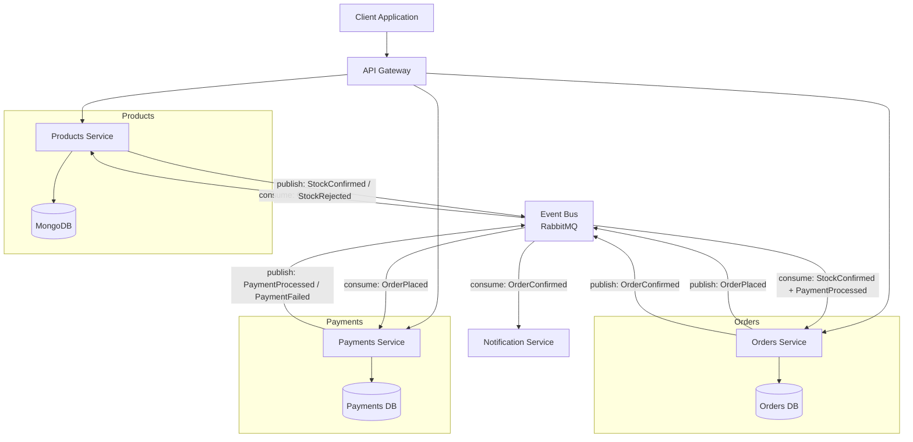

# Architecture Overview

This document describes how the Products Service fits into the broader microservices event-driven architecture.

## System Diagram

## Event Flow

1. **OrderPlaced** -- The Orders Service publishes this event when a customer submits a new order.
2. **Stock Check** -- The Products Service consumes `OrderPlaced`, verifies inventory, and publishes `StockConfirmed` or `StockRejected`.
3. **Payment Processing** -- The Payments Service consumes `OrderPlaced`, processes the payment, and publishes `PaymentProcessed` or `PaymentFailed`.
4. **OrderConfirmed** -- Once the Orders Service receives both `StockConfirmed` and `PaymentProcessed`, it publishes `OrderConfirmed`.
5. **Notification** -- The Notification Service consumes `OrderConfirmed` and sends a confirmation to the customer.

## Services

| Service | Responsibility | Data Store |
|---------|---------------|------------|
| API Gateway | Routing, authentication, rate limiting | -- |
| Products Service | Product catalog, inventory management | MongoDB |
| Orders Service | Order lifecycle, saga orchestration | Orders DB |
| Payments Service | Payment processing, refunds | Payments DB |
| Notification Service | Email, SMS, push notifications | -- |
